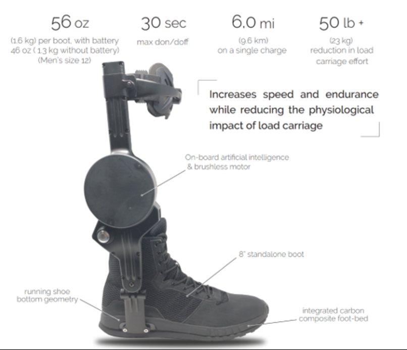
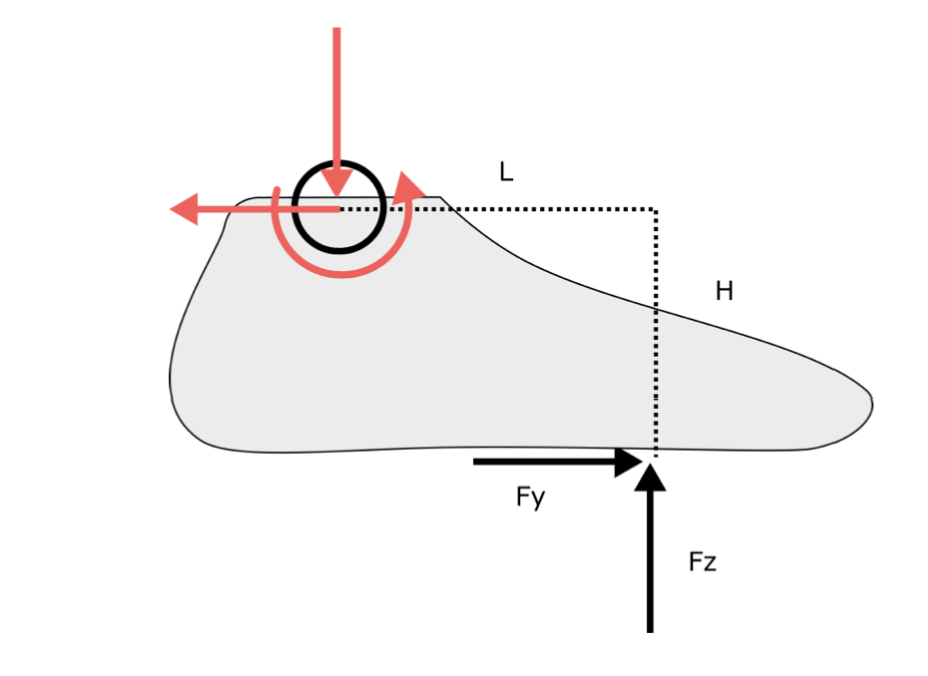
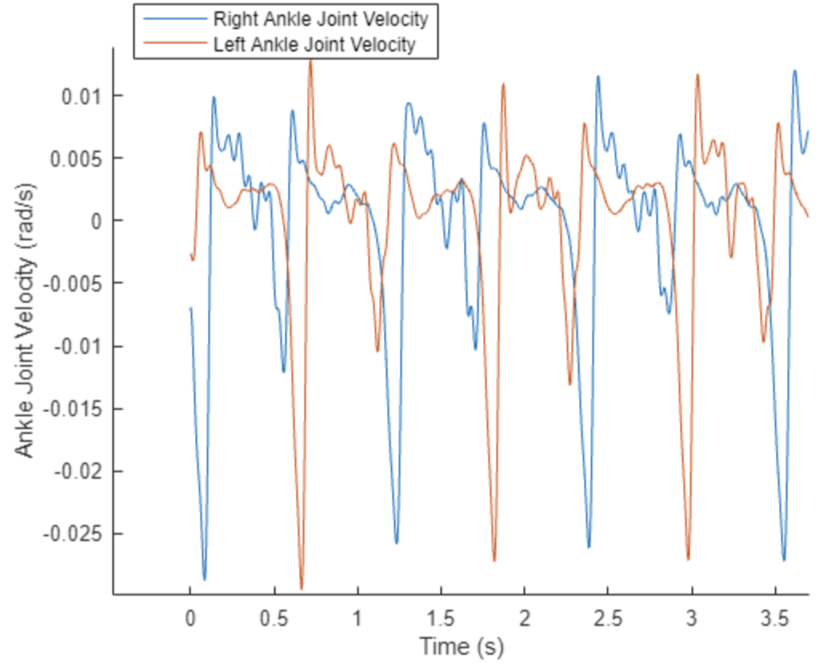
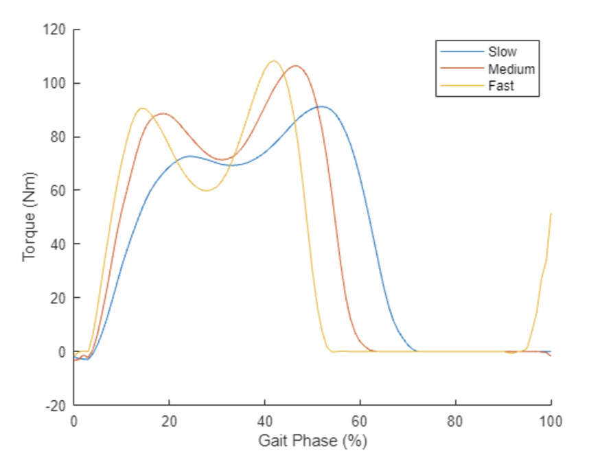
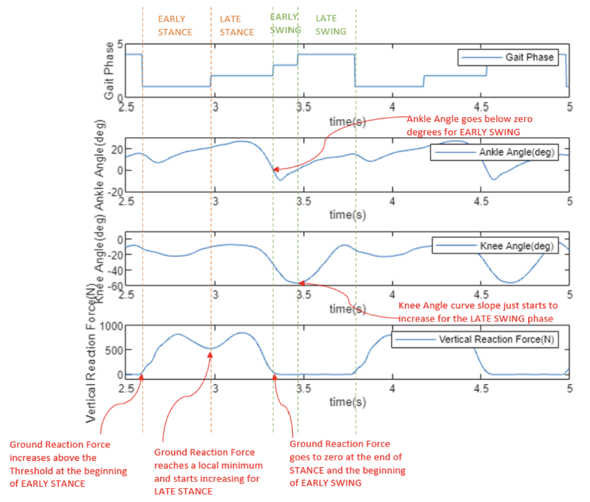
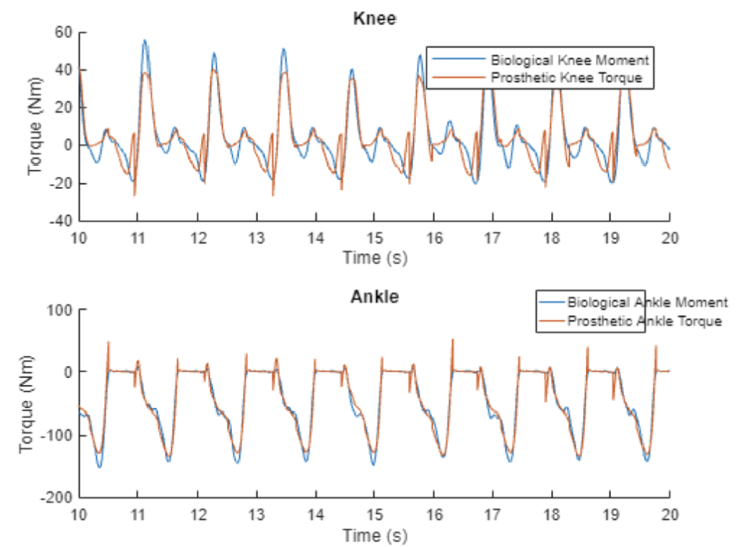
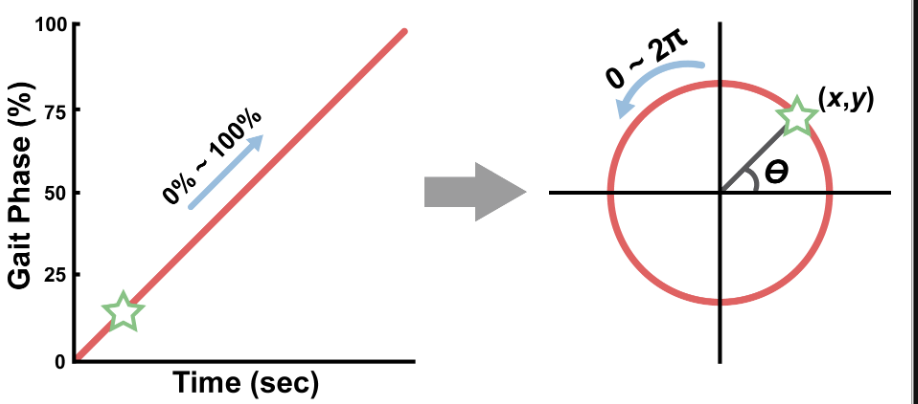
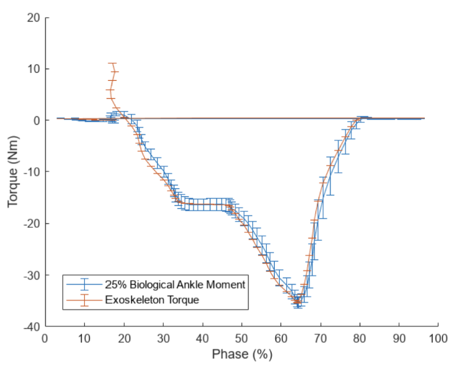
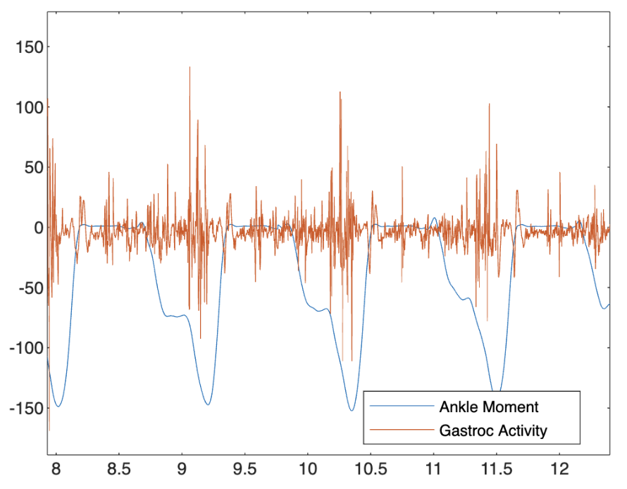

# Assitive Walking Robotic Exoskeleton Controller 

<figure align="center">  
     	
</figure>

**[Note: Project Completed in Feb. – Apr. 2023 as a part of Wearable Robotics Coursework.]**

## Overview: Ankle Exoskeleton

    <figure style="text-align: center;">
        
<!--         <figcaption>Ankle Exoskeleton</figcaption> -->
    </figure>
    <figure style="text-align: center;">
        
<!--         <figcaption>Foot Forces Diagram</figcaption> -->
    </figure>

This project aims to build an end-to-end stacked Control Logic for an Assistive Exoskeleton Controller. Each of the human movements like level walking, incline walking or running are sequential and thus, exhibit distinguishable joint trajectories and ground force amplitudes (as seen above) wrt time. We tracked the signals using IMU(like in gyroscope) and EMG(for tracking muscle activity) to train an ML model to recognize the movements and predict the next state of joint and generated reactive forces. 

These predictions could then directly be mapped to instead generate an assitive torque in a mechanical motor to replace some of the muscle torque and curtail on the human effort. We also identify the transition states and differentiate Gait Phases during walking, as explained in "Multilevel Controller Logic" below.

## Applications
This work has applications in biomedical engineering to aid people having specific walking disabilities, amputees for gait correction. Another important field is military assitance to utilize exoskeletons to carry high payloads in non-normal terrains. Nowadays, this technology is being applied to assist General walking for long distances which could minimize the human muscle effort.

## How to Use this repo?
The pdfs as well as working directories for Matlab Workbooks with the same name are include in this repo.
1. Download the Matlab Desktop app from [Matlab Desktop Download Site](https://www.mathworks.com/products.html?s_tid=mlh_gn_ps) and create an account.
    
    or

    You may work online directly on [Matlab Online Site](https://www.mathworks.com/products/matlab-online.html?status=SUCCESS) by creating an account.
2. Fork this repo and Clone to your local.

    `git clone {repo}`

3. You can import the file modules directly into your workspace for replication study. However, you may have to edit paths and folder structure as per your preferences.

## Multilevel Controller Logic
### Part I: Sensor Data Processing (Low-level Logic)
This data is crucial for understanding the user’s movement intentions and adapting the exoskeleton’s actions accordingly. Advanced algorithms, including sensor fusion, real-time signal processing, and machine learning, are employed to extract meaningful insights, such as gait patterns, joint angles, and load distribution. The processed data ensures precise actuation, stability, and synchronization of the exoskeleton with the user’s natural biomechanics, enhancing mobility, reducing fatigue, and providing rehabilitation support for individuals with lower body impairments.

This sub-module contains functions that preprocess the raw sensor data using filters hence, also called the Low-level Logic module. It begins by processing the ankle trajectory and velocity data with a 4th order, 10 Hz, zero-lag low-pass butterworth filter. [Left Plot Below]

    <figure style="text-align: center;">
        
<!--         <figcaption>Filtered Joint Velocities Plot</figcaption> -->
    </figure>
    <figure style="text-align: center;">
        
<!--         <figcaption>Stride Torques</figcaption> -->
    </figure>

Additionally, we also process the data on Ground forces and plot the mean Ankle biological power. We model the motion of ankle as cyclic and analogous to a Biological spring to under stand the power dynamics. Subsequently, it helps us track the changes in plots during slow, medium and fast strides. [Right Plot Above]

### Part II: Prosthesis Gait and Incline Classifier Controller (Mid-Level Logic)

Prosthesis Gait and Incline Classifier Control optimizes the functionality of prosthetic devices by accurately classifying user gait phases and environmental inclines. By utilizing sensor inputs such as inertial measurement units (IMUs), and foot-pressure sensors for ground force acquisition, this controller applies machine learning algorithms to identify the user's gait patterns and the slope of the walking surface in real time. The classifier distinguishes between various terrains, such as level ground, stairs, and ramps, and adapts the prosthetic's movements accordingly to ensure stability, comfort, and energy efficiency. This advanced control mechanism empowers users with enhanced mobility and confidence across diverse environments, significantly improving their quality of life.

This sub-module contains Control Logic for Mid-level Logic for Foot State-wise Segmentation (Early Stance, Late Stance, Early Swing, Late Swing) depicting whether the foot is in contact with ground or not. [Left Plot Below]

    <figure style="text-align: center;">
        
<!--         <figcaption>Phase-Aligned Trajectory Plots</figcaption> -->
    </figure>
    <figure style="text-align: center;">
        
<!--         <figcaption>Biological v/s Prosthetic Torque Plot</figcaption> -->
    </figure>

Here, we also devise an accurate classifier to identify the ground level incline, as we determined the power requirements vary accordingly. Thus, we can design the motor power-saving or boosting map as per assistive power requirements for the human. [Right Plot Above]

### Part III: ML based Gait Phase Predictor and Torque Mapper (High-Level Logic) 

ML-Based Gait Phase Predictor and Torque Mapper is a cutting-edge approach leveraging machine learning to enhance the control and efficiency of assistive devices such as exoskeletons and prosthetics. This system uses sensors like inertial measurement units (IMUs) and electromyographic (EMG) signals to predict the user’s gait phase—stance, swing, or transitions—by analyzing movement patterns in real time. Machine learning models, trained on diverse gait datasets, can identify subtle variations in user motion and environmental conditions, ensuring adaptability. The torque mapper translates these predictions into precise torque commands for actuators, aligning the device’s movements with the user’s biomechanics. This integration improves device responsiveness, reduces cognitive load, and enables seamless, natural locomotion, benefiting individuals with mobility impairments.

While our model accurately predicts the heel strike and push off forces, we observe a strong discontinuity during feet switching that prevents the linear motor torque scaling and mapping. The trick introduced here is converting our trajectory signals using sine-cos functions to capture the cyclic nature [Left Plot below]. We finally trained the new ML-model that accurately captures and maps the natural locomotion to required motor torque. [See Right Plot Below]

We achieve a significantly low RMSE of 2.177 Nm after scaling down the power at 75% for Normal walking. While we scale power down by 80% for slow walking, we need to further tune our controller for efficiency as the RMSE achieved was comparably higher 7.13 Nm (Note that, since the forces change directions, RMSE penalizes controller worsely).

    <figure style="text-align: center;">
        
<!--         <figcaption>Modeling Cyclic Gait Motion</figcaption> -->
    </figure>
    <figure style="text-align: center;">
        
<!--         <figcaption>ExoTorque Attenuated</figcaption> -->
    </figure>

### Part III-B: Alternative EMG Control
<figure style="text-align: center;">
    
    <figcaption>Resampled EMG Plot</figcaption>
</figure>

EMG based methods are comparatively newer and this field explores novel methods for interpreting muscle activity data to enable precise, intuitive, and versatile interactions. By expanding the usability of EMG-based interfaces, these methods aim to create more adaptable and personalized solutions for human-machine interaction.

We experimented with filtering techniques, as seen in the workbook. However, higher sensitivity sensors and access to multimodal data is required for engineering robust features. Thus, this technique was beyond the scope of this project.
